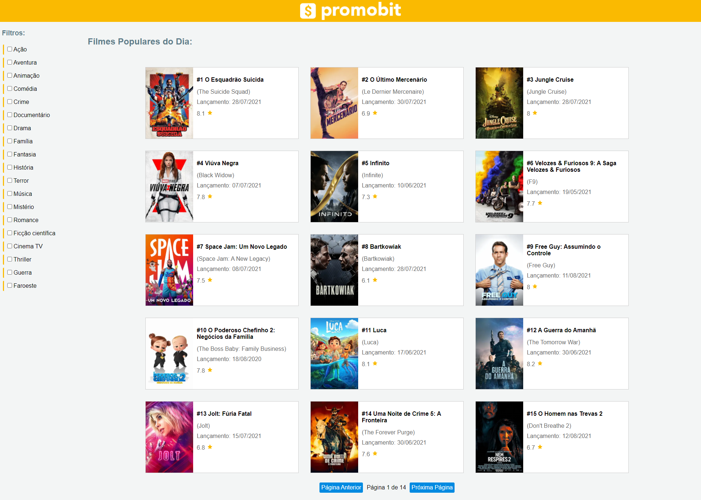
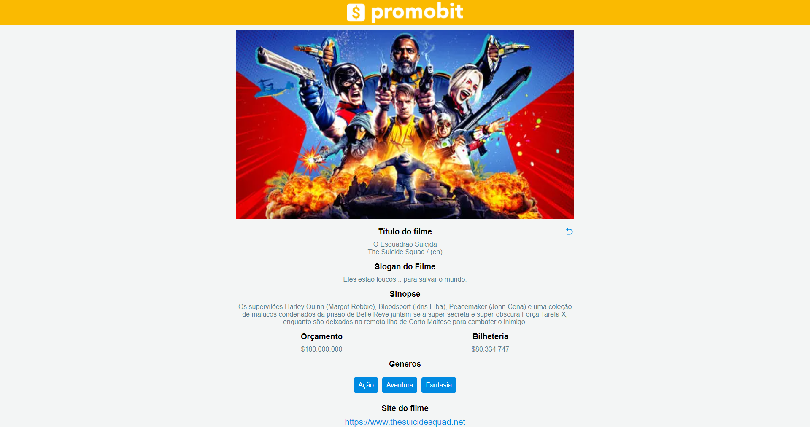

[](https://github.com/ikaroamorim/promobit-movies/commits/master)

[](https://github.com/ikaroamorim/promobit-movies/stargazers)

<h1 align="center">Promobit Movies</h1>

<p align="center">
 <a href="#descricao">Descrição do Projeto</a> •
 <a href="#instalacao">Instalação</a> • 
 <a href="#tecnologias">Tecnologias</a> • 
 <a href="#autor">Autor</a> • 
 <a href="#imagens">Imagens</a>
</p>

<a name="descricao"></a>
## 💻 Descrição do Projeto 
<p>Promobit Movies é uma aplicação que tem como objetivo buscar os filmesmais populares no The Movie DB e listá-los, tendo uma página de detalhes para cada um.
   O projeto contou com o desenvolvimento de filtro e páginação dos resultados, tabém com as busca dos itens na API e gereção Geração de Páginas Estáticas (SSG).
Na elaboração do projeto foram utilizados conceitos avançados de React.js e Next.js. A aplicação foi hospedada na vercel (https://promobit-movies.vercel.app/) </p>

<a name="instalacao"></a>
## 📦 Instalação Local

### Pré-requisitos
Para a utilização é necessária a instalação das seguintes dependências
Antes de começar, você vai precisar ter instalado em sua máquina as seguintes ferramentas:
[Git](https://git-scm.com)
[Node 12.0+](https://nodejs.org/en/)

### Instalação e execução em Dev

```bash
# Clone este repositório
$ git clone https://github.com/ikaroamorim/promobit-movies.git

# Acesse a pasta do projeto no terminal/cmd
$ cd promobit-movies

# Instale as dependências (utilizando yarn, mas pode também ser utilizado o npm)
$ yarn install

# Execute a aplicação em modo de desenvolvimento
$ yarn dev
```

<a name="tecnologias"></a>
## 🛠 Tecnologias

As seguintes ferramentas foram usadas na construção do projeto:

- [Node.js](https://nodejs.org/en/)
- [React](https://pt-br.reactjs.org/)
- [Next.js](https://nextjs.org/)
- [TypeScript](https://www.typescriptlang.org/)
- [Axios](https://github.com/axios/axios)

<a name="autor"></a>
## 👨‍💻 Autor
<a href="https://www.linkedin.com/in/ikaroamorimesilva/">
 
 <br />
 <sub><b>Ikaro Amorim e Silva</b></sub>
 </a>

Feito com ❤️ por Ikaro Amorim e Silva

[](https://twitter.com/ikaroamorim) [](https://www.linkedin.com/in/ikaroamorimesilva/) 
[](mailto:ikaro.amorim@gmail.com)

<a name="imagens"></a>
## 🌍 Imagens e vídeos





